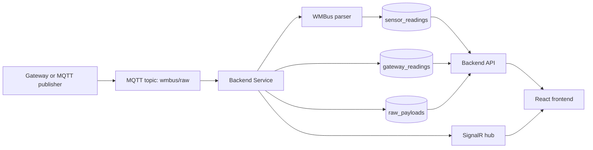

# Yrki.IoT

Yrki.IoT is an IoT platform for receiving, decoding, storing, and visualizing sensor data.

The solution currently focuses on wireless M-Bus payloads transported through MQTT, with a .NET backend, a React frontend, and PostgreSQL/TimescaleDB for storage. It supports sensor and gateway tracking, live updates through SignalR, location management, encryption key handling, and historical sensor charts.

See [ARCHITECTURE.md](ARCHITECTURE.md) for the repository's vertical-slice architecture guidelines.

## What the project does

- receives raw WMBus payloads
- stores raw payloads and parsed sensor readings
- decodes supported devices such as Lansen and Axioma meters
- tracks gateways and sensor-to-gateway contact history
- exposes an API for devices, locations, readings, gateways, and auth
- shows sensor and gateway data in a React UI with live updates
- supports encryption key management for encrypted devices

## Tech stack

- Backend: .NET 10, ASP.NET Core, EF Core, MassTransit, SignalR
- Frontend: React 19, TypeScript, Vite, MUI, Recharts
- Database: PostgreSQL with TimescaleDB
- Messaging: RabbitMQ
- Ingestion: MQTT via Mosquitto

## Repository layout

```text
.
├── docker-compose.yml
├── Readme.md
├── ARCHITECTURE.md
├── src/
│   ├── backend/
│   │   ├── Api/
│   │   ├── Core/
│   │   ├── Contracts/
│   │   ├── Service/
│   │   ├── Simulator/
│   │   └── tests/
│   └── frontend/
└── scripts/
```

Key projects:

- `src/backend/Api`: HTTP API, auth endpoints, SignalR hub, database migration startup
- `src/backend/Service`: background ingestion/parsing service
- `src/backend/Core`: domain models, EF Core, feature handlers, migrations
- `src/backend/Contracts`: shared message and response contracts
- `src/backend/Simulator`: optional simulator process
- `src/backend/tests`: backend tests
- `src/frontend`: web UI

## Prerequisites

- Docker and Docker Compose
- .NET SDK 10.x if you want to run backend projects directly
- Node.js 20+ and npm if you want to run the frontend directly
- A NuGet config with access to the `yrki` GitHub package feed for `Yrki.IoT.WMBus.Parser`

The compose setup mounts this file from your home directory:

```text
~/.nuget/NuGet/NuGet.Config
```

## Quick start with Docker

This is the simplest way to bring the full stack up.

```bash
docker-compose up --build
```

Main endpoints:

- Frontend: `http://localhost:8080`
- API from host: `http://localhost:8081`
- PostgreSQL: `localhost:5432`
- RabbitMQ management: `http://localhost:15672`
- MQTT broker: `localhost:1883`

Default local credentials:

- PostgreSQL: `postgres` / `postgres`
- RabbitMQ: `guest` / `guest`

## Startup options

The repository includes a few convenience scripts.

Run everything:

```bash
./start.sh
```

Run infrastructure and backend containers only:

```bash
./start-backend.sh
```

Run only infrastructure:

```bash
./start-infrastructure.sh
```

## Running parts locally

### Frontend

```bash
cd src/frontend
npm install
npm run dev
```

The frontend dev server defaults to Vite's local port and talks to the API through `VITE_API_BASE_URL` if set.

### Backend API

```bash
dotnet run --project src/backend/Api/Api.csproj
```

### Backend service

```bash
dotnet run --project src/backend/Service/Service.csproj
```

### Database migrations

The API applies migrations on startup. You can also update manually:

```bash
dotnet ef database update --project src/backend/Core/Core.csproj --startup-project src/backend/Api/Api.csproj
```

## Configuration

Important environment variables used by the compose setup:

- `ConnectionStrings__DatabaseConnectionString`
- `Encryption__MasterKey`
- `MagicLink__FrontendBaseUrl`
- `RabbitMq__Host`
- `RabbitMq__Port`
- `RabbitMq__Username`
- `RabbitMq__Password`
- `Mqtt__Enabled`
- `Mqtt__Host`
- `Mqtt__Port`
- `Mqtt__Topic`
- `Api__BaseUrl`

Relevant defaults from `docker-compose.yml`:

- API inside container listens on `http://0.0.0.0:8080`
- Host maps API to `http://localhost:8081`
- Frontend container serves on `http://localhost:8080`
- MQTT topic defaults to `wmbus/raw`

### Encryption master key

Encrypted device keys depend on `Encryption__MasterKey`. For local development, compose provides a default value. If you change it after storing encryption keys, previously stored encrypted keys may no longer decrypt.

### Magic link login

The frontend uses magic-link authentication. In local compose, `MagicLink__FrontendBaseUrl` defaults to `http://localhost:8080` for the full stack and `http://localhost:5173` in `start-backend.sh`.

## Frontend routes

The frontend uses client-side routing. Current routes include:

- `/sensors`
- `/sensors/:sensorId`
- `/gateways`
- `/gateways/:gatewayId`
- `/locations`
- `/locations/:locationId`
- `/new-sensors`
- `/auth/callback`

## OpenAPI types

The frontend includes a script for regenerating TypeScript types from the backend Swagger document:

```bash
cd src/frontend
npm run openapi:types
```

Default source:

```text
http://localhost:5180/swagger/v1/swagger.json
```

Override with `OPENAPI_URL` if needed.

## Testing and verification

Run backend tests:

```bash
dotnet test Yrki.IoT.slnx
```

Run frontend tests:

```bash
cd src/frontend
npm test
```

Build the frontend:

```bash
cd src/frontend
npm run build
```

Run a focused backend test project:

```bash
dotnet test src/backend/tests/tests.csproj
```

## Data flow



## Notes

- The compose setup persists local data under `volumes/`.
- Core dumps and Codex temp files are ignored in git.
- The frontend build currently includes a large logo asset under `src/frontend/src/assets/logo.png`.
- The repository uses a vertical-slice structure. Keep feature logic inside the owning feature whenever possible.
